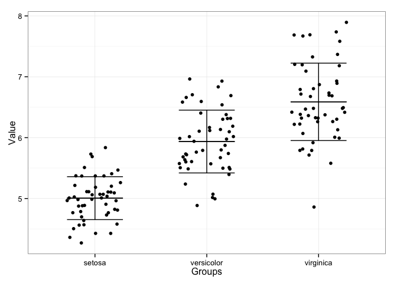
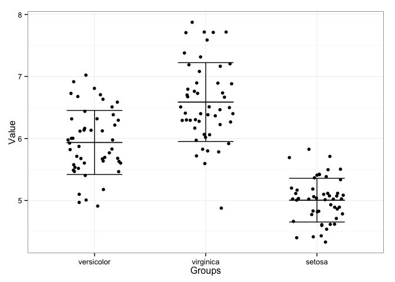

# How to: scatterplot by category with mean and SD shown (ggplot2)
Bianca Tesi  
26 Oct 2014  

How to: \
1. make a scatteplot for different categories (sometimes it is better than a box plot) \
2. show the mean value \
3. show +- SD as error bars \
4. all in ggplot2 \
\
 
You may have to reshape your table with reshape2

My use case was to plot the level of NK cells cytotoxic activity in two group of patients (and also of their parents and experimental controls, 6 categories in total, with different number of individuals for each category).
With few data points and different number of individuals per group, I think the "categorical scatterplot" is more informative than a box plot or bar plot. 


```r
library(ggplot2)
#Found here:http://sharpstatistics.co.uk/r/ggplot2-guide/

#calculate the mean+-SD (the ymin is ==0 if mean-sd<0 and negative values make no sense)
myFunc = function(x) {
result = c(mean(x) - sd(x), mean(x) + sd(x))
if (result[1]<0){result[1]=0}
names(result) = c("ymin", "ymax")
result
}

theme_set(theme_bw())
g <- ggplot(iris, aes(Species, Sepal.Length)) + xlab("Groups") + ylab("Value")
g = g + geom_jitter(position=position_jitter(width=0.25))  
g = g + stat_summary(fun.data = "myFunc", geom = "errorbar", width = 0.5, size=0.5) 
g = g + stat_summary(fun.y=mean,fun.ymin = mean, fun.ymax = mean, geom="crossbar", size = 0.3, width=0.5) 
g
```

 

If you'd like to display a different order than the one default:


```r
g <- ggplot(iris, aes(factor((Species),levels=c("versicolor", "virginica", "setosa")), Sepal.Length)) + xlab("Groups") + ylab("Value")
g = g + geom_jitter(position=position_jitter(width=0.25))  
g = g + stat_summary(fun.data = "myFunc", geom = "errorbar", width = 0.5, size=0.5) 
g = g + stat_summary(fun.y=mean,fun.ymin = mean, fun.ymax = mean, geom="crossbar", size = 0.3, width=0.5) 
g
```

 


