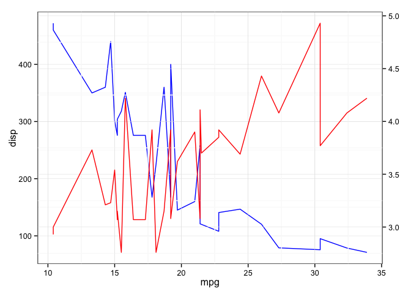
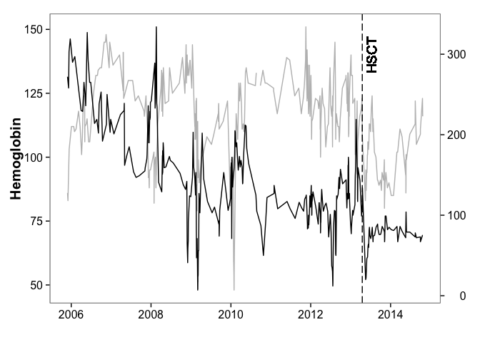

# How to: plot with dual y axes (ggplot2)
Bianca Tesi  
25 Nov 2014  

How to: \
1. make a scatteplot for different categories (sometimes it is better than a box plot) \
2. show the mean value \
3. show +- SD as error bars \
4. all in ggplot2 \
\
 
You may have to reshape your table with reshape2

My use case was to plot the level of Hemoglobin and Thrombocytes in a patient followed for several years. Also I want to indicate the time point when the patient received HSCT.

First a general case use:
from [http://rpubs.com/kohske/dual_axis_in_ggplot2](http://rpubs.com/kohske/dual_axis_in_ggplot2)

```r
library(ggplot2)
library(gtable)
```

```
## Loading required package: grid
```

```r
library(grid)

grid.newpage()

# two plots
p1 <- ggplot(mtcars, aes(mpg, disp)) + geom_line(colour = "blue") + theme_bw()
p2 <- ggplot(mtcars, aes(mpg, drat)) + geom_line(colour = "red") + theme_bw() %+replace% 
    theme(panel.background = element_rect(fill = NA))

# extract gtable
g1 <- ggplot_gtable(ggplot_build(p1))
g2 <- ggplot_gtable(ggplot_build(p2))

# overlap the panel of 2nd plot on that of 1st plot
pp <- c(subset(g1$layout, name == "panel", se = t:r))
g <- gtable_add_grob(g1, g2$grobs[[which(g2$layout$name == "panel")]], pp$t, 
    pp$l, pp$b, pp$l)

# axis tweaks
ia <- which(g2$layout$name == "axis-l")
ga <- g2$grobs[[ia]]
ax <- ga$children[[2]]
ax$widths <- rev(ax$widths)
ax$grobs <- rev(ax$grobs)
ax$grobs[[1]]$x <- ax$grobs[[1]]$x - unit(1, "npc") + unit(0.15, "cm")
g <- gtable_add_cols(g, g2$widths[g2$layout[ia, ]$l], length(g$widths) - 1)
g <- gtable_add_grob(g, ax, pp$t, length(g$widths) - 1, pp$b)

# draw it
grid.draw(g)
```

 

Now my specific case use. (this will not work unless I provide you with the dataset)\
Further improvement required: \
- add legend for lines or y axes label on both side, with text color matching line color \


```r
blod <- read.table("~/Karolinska/Lab/WES/BGI_WES_2014/follow_up/2086/lab_data/Blodstatus_141122", sep="\t", header=T, stringsAsFactors = F , fill=T)
blod <- blod[,-4]
blod$Resultat <- as.numeric(sub(",", ".", blod$Resultat, fixed = TRUE))
```

```
## Warning: NAs introduced by coercion
```

```r
blod$Provtagningstidpunkt <- as.Date(blod$Provtagningstidpunkt,  "%d/%m/%y")
head(blod)
```

```
##   Provtagningstidpunkt Resultat     Enhet   Rapportnamn
## 1           2014-10-22     3.00  x10(9)/L  B-Leukocyter
## 2           2014-10-22     3.90 x10(12)/L B-Erytrocyter
## 3           2014-10-22   116.00       g/L  B-Hemoglobin
## 4           2014-10-22     0.33     0,33*              
## 5           2014-10-22    84.00        fL    Erc(B)-MCV
## 6           2014-10-22    30.00        pg    Erc(B)-MCH
```

```r
grid.newpage()
blod_m1 <- subset(blod, blod$Rapportnamn=="B-Hemoglobin")
p1 <- ggplot(blod_m1, aes(x=Provtagningstidpunkt, y=Resultat, group=Rapportnamn, color=Rapportnamn)) + geom_line(colour = "grey") + theme_bw() + theme(axis.text=element_text(size=12),axis.title=element_text(size=15,face="bold")) + ylab("Hemoglobin") + xlab("") + geom_vline(xintercept = as.numeric(blod_m1$Provtagningstidpunkt[56]),linetype = "longdash") + geom_text(aes(blod_m1$Provtagningstidpunkt[56], label="HSCT", y=140), colour="black", angle=90, vjust = 1.5, text=element_text(size=3))
p1 <- p1 + theme(panel.grid.major = element_blank(), panel.grid.minor = element_blank(), panel.background = element_blank())

blod_m2 <- subset(blod, blod$Rapportnamn=="B-Trombocyter")
p2 <- ggplot(blod_m2, aes(x=Provtagningstidpunkt, y=Resultat, group=Rapportnamn, color=Rapportnamn))+ geom_line(colour = "black") + theme_bw() + theme(axis.text=element_text(size=12),axis.title=element_text(size=15,face="bold"))  %+replace%  
  theme(panel.background = element_rect(fill = NA))
p2 <- p2 + theme(panel.grid.major = element_blank(), panel.grid.minor = element_blank(), panel.background = element_blank())


 

# extract gtable
g1 <- ggplot_gtable(ggplot_build(p1))
g2 <- ggplot_gtable(ggplot_build(p2))

# overlap the panel of 2nd plot on that of 1st plot
pp <- c(subset(g1$layout, name == "panel", se = t:r))
g <- gtable_add_grob(g1, g2$grobs[[which(g2$layout$name == "panel")]], pp$t, 
                     pp$l, pp$b, pp$l)

# axis tweaks
ia <- which(g2$layout$name == "axis-l")
ga <- g2$grobs[[ia]]
ax <- ga$children[[2]]
ax$widths <- rev(ax$widths)
ax$grobs <- rev(ax$grobs)
ax$grobs[[1]]$x <- ax$grobs[[1]]$x - unit(1, "npc") + unit(0.15, "cm")
g <- gtable_add_cols(g, g2$widths[g2$layout[ia, ]$l], length(g$widths) - 1)
g <- gtable_add_grob(g, ax, pp$t, length(g$widths) - 1, pp$b)

# draw it
grid.draw(g)
```

 


