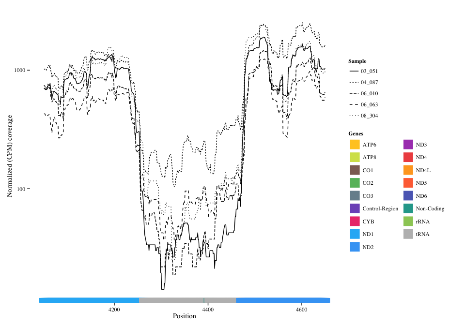
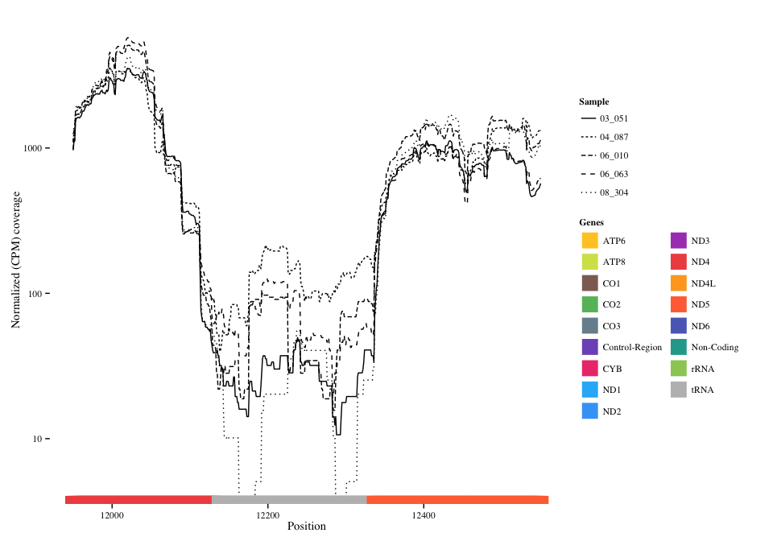

# Coverage of RNA-seq reads across MT gene-tRNA junctions
Vasilios Zachariadis  
2014-11-29  

### Objectives: 

* Calculate and plot coverage across RNase Z cleavage sites in mtDNA

### Requirements:

* RNA-sequencing reads aligned (BAM-files)
* Regions of interest defined in BED file format [Optional]
* `bedtools` executable in your path

***

An example of the desired output is figure 3 of [Haack et al, AJHG 2013](http://www.sciencedirect.com/science/article/pii/S0002929713002759)

> For comparison, the relative coverage was calculated separately for each sample by dividing the coverage at each position by the number of reads mapped to mtDNA multiplied by 1 Mio (average number of mapped reads was 0.85 Mio over all samples).

### In Bash

Read BAM file, split out reads mapping to mtDNA and count coverage per strand.
Calculate nucleotide level coverage using `coverageBed` in [bedtools](http://bedtools.readthedocs.org/).

```{shell}
# On Uppmax
module load bioinfo-tools samtools BEDTools

inbam=$1

mkdir -vp mt-subset/bams
# Based on [sampleid]/aligned.bam convention, get dirname as sample id
filename=$(dirname $inbam)

if [[ ! -f $inbam.bai ]]
then
 samtools index $inbam
fi
if [[ ! -f mt-subset/bams/mt.$filename.bam || ! -f mt-subset/bams/mt.$filename.stat  ]]
then 
  samtools view -bh $inbam MT > mt-subset/bams/mt.$filename.bam
  samtools flagstat mt-subset/bams/mt.$filename.bam > mt-subset/bams/mt.$filename.stat
fi

# get nr of mapped reads, divide by 1M to normalize
reads=$(grep "0 mapped" mt-subset/bams/mt.$filename.stat | cut -f1 -d " ")
norm=`awk -v n=$reads 'BEGIN{norm=1000000/n;print norm}'` # use awk to divide by 1 million
# can add -scale argument to genomeCoverageBed for normalization

genomeCoverageBed -ibam mt-subset/bams/mt.$filename.bam -d -split -strand + -scale $norm > mt-subset/mt.$filename.plus.cov
genomeCoverageBed -ibam mt-subset/bams/mt.$filename.bam -d -split -strand - -scale $norm > mt-subset/mt.$filename.minus.cov
```

### In R


```r
library(knitr)
library(ggplot2)
library(plyr)
library(reshape2)
library(ggthemes)
dirpath <- "~/sandbox/141130-mt-RNA-expression/"
```


```r
plusfiles <- list.files(path = dirpath, pattern="*plus*")
minusfiles <- list.files(path = dirpath, pattern="*minus*")
plus.df <- ldply(plusfiles, function(x){data.frame(read.table(paste(dirpath,x,sep=""), col.names=c("Chrom","Position", "Coverage"),sep="\t"),"Sample"=sub(".plus.cov","",sub("mt.","",x)), "Strand"="Plus")})
min.df <- ldply(minusfiles, function(x){data.frame(read.table(paste(dirpath,x,sep=""), col.names=c("Chrom","Position", "Coverage"),sep="\t"),"Sample"=sub(".minus.cov","",sub("mt.","",x)), "Strand"="Minus")})
coverage <- rbind(plus.df, min.df)
```


Plot all samples, split by strand

*Note: BEDTools `-strand` option does not account for 'first-in-pair' strandedness, which is what we would be looking for when plotting sense vs antisense transcription. For this an option is to use STAR to output a bedgraph file instead*


```r
head(coverage)
```

```
##   Chrom Position Coverage Sample Strand
## 1    MT        1  16.7240 00_208   Plus
## 2    MT        2  17.0724 00_208   Plus
## 3    MT        3  17.2466 00_208   Plus
## 4    MT        4  17.2466 00_208   Plus
## 5    MT        5  17.2466 00_208   Plus
## 6    MT        6  17.4208 00_208   Plus
```

```r
p <- ggplot(coverage, aes(x=Position, y=Coverage, color=Sample)) + geom_line() + theme_minimal()
p <- p + scale_y_log10(expand=c(0,0))
p <- p + facet_grid(Strand~.)
plot(p)
```


Alternatively, use the total coverage (both strands) or even means across samples with 95% error margins


```r
plus.df <- ldply(plusfiles, function(x){data.frame(read.table(paste(dirpath,x,sep=""), col.names=c("Chrom","Position", "Plus"),sep="\t"),"Sample"=sub(".plus.cov","",sub("mt.","",x)))})
min.df <- ldply(minusfiles, function(x){data.frame(read.table(paste(dirpath,x,sep=""), col.names=c("Chrom","Position", "Minus"),sep="\t"),"Sample"=sub(".minus.cov","",sub("mt.","",x)))})
coverage <- merge(plus.df, min.df, by = c("Chrom","Position","Sample"))
coverage$Coverage <- coverage$Plus+coverage$Minus
```


```r
p <- ggplot(coverage, aes(x=Position, y=Coverage, color=Sample)) + geom_line() + theme_minimal()
p <- p + scale_y_log10()
p <- p + facet_grid(Sample~.)
plot(p)
```


***

Plot limited region, across individual RNase Z cleave sites (subsampling some cases)

(first prepare gene annotations for plot)

```r
materialcolors <- c("#EF5350", "#EC407A", "#AB47BC", "#7E57C2", "#5C6BC0", "#42A5F5", "#29B6F6", "#26C6DA", "#26A69A", "#66BB6A", "#9CCC65", "#D4E157", "#FFEE58", "#FFCA28", "#FFA726", "#FF7043", "#8D6E63", "#78909C")
material_grey <- "#BDBDBD"
mtregions <- c("Control-Region", "tRNA", "rRNA", "Non-Coding", "ND1", "ND2", "CO1", "CO2", "ATP8", "ATP6", "CO3", "ND3", "ND4L", "ND4", "ND5", "ND6", "CYB")
mtcolors <- sample(materialcolors, length(mtregions))
names(mtcolors) <- mtregions
mtcolors["tRNA"] <- material_grey

# Create gene boundaries and lines
addgenelabel <- function(bp,gene) { gene <- ifelse(bp < 577,gene <- "Control-Region", ifelse(bp < 648,gene <- "tRNA", ifelse(bp < 1602,gene <- "rRNA", ifelse(bp < 1671,gene <- "tRNA", ifelse(bp < 3230,gene <- "rRNA", ifelse(bp < 3305,gene <- "tRNA", ifelse(bp < 3307,gene <- "Non-Coding", ifelse(bp < 4263,gene<- "ND1", ifelse(bp < 4332,gene <- "tRNA", ifelse(bp < 4401,gene <- "tRNA", ifelse(bp < 4402,gene <- "Non-Coding", ifelse(bp < 4470,gene <- "tRNA", ifelse(bp < 5512,gene <- "ND2", ifelse(bp < 5580,gene <- "tRNA", ifelse(bp < 5587,gene <- "Non-Coding", ifelse(bp < 5656,gene <- "tRNA", ifelse(bp < 5657,gene <- "Non-Coding", ifelse(bp < 5730,gene <- "tRNA", ifelse(bp < 5826,gene <- "tRNA", ifelse(bp < 5892,gene <- "tRNA", ifelse(bp < 5904,gene <- "Non-Coding", ifelse(bp < 7446,gene <- "CO1", ifelse(bp < 7515,gene <- "tRNA", ifelse(bp < 7518,gene <- "Non-Coding", ifelse(bp < 7586,gene <- "tRNA", ifelse(bp < 8270,gene <- "CO2", ifelse(bp < 8295,gene <- "Non-Coding", ifelse(bp < 8365,gene <- "tRNA", ifelse(bp < 8366,gene <- "Non-Coding", ifelse(bp < 8573,gene <- "ATP8", ifelse(bp < 9208,gene <- "ATP6", ifelse(bp < 9991,gene <- "CO3", ifelse(bp < 10059,gene <- "tRNA", ifelse(bp < 10405,gene <- "ND3", ifelse(bp < 10470,gene <- "tRNA", ifelse(bp < 10767,gene <- "ND4L", ifelse(bp < 12138,gene <- "ND4", ifelse(bp < 12207,gene <- "tRNA", ifelse(bp < 12266,gene <- "tRNA", ifelse(bp < 12337,gene <- "tRNA", ifelse(bp < 14149,gene <- "ND5", ifelse(bp < 14674,gene <- "ND6", ifelse(bp < 14743,gene <- "tRNA", ifelse(bp < 14747,gene <- "Non-Coding", ifelse(bp < 15888,gene <- "CYB", ifelse(bp < 15954,gene <- "tRNA", ifelse(bp < 15956,gene <- "Non-Coding", ifelse(bp < 16024,gene <- "tRNA", ifelse(bp < 17000,gene <- "Control-Region") ))))))))))))))))))) ))))))))))))))))))) ))))))))) ) }
visibleboundaries <- c(1,576,1601,3229,4262,5511,7445,8269,9207,9990,10404,10766,12137,14148,14673,15887)

bdries <- data.frame(x = visibleboundaries,y=0.1)
bdries$gene <- addgenelabel(bdries$x,bdries$gene)

lines <- data.frame(x = seq(0,16567,by=1),y = 0)
lines$gene <- addgenelabel(lines$x,lines$gene)
```


```r
samples <- sample(levels(coverage$Sample), 5)
start <- 4050
end <- 4650
sub <- coverage[coverage$Sample %in% samples, ]
sub <- sub[sub$Position >= start & sub$Position <= end,]
sub$Genes <- as.factor(addgenelabel(sub$Position, sub$Genes))
p <- ggplot(sub, aes(x=Position, y=Coverage)) + 
  geom_line(aes(linetype=Sample)) +
  geom_point(aes(x,y,color = gene),data=lines,size=7,pch=15) +
  scale_colour_manual(values=mtcolors, guide=guide_legend(title="Genes", legend.position="bottom", ncol=2, bycol=TRUE)) +
  #layer(geom="text",mapping =aes(x,min(sub$Coverage)-9,label = x),data = bdries,size=4) + 
  xlim(c(start,end)) + 
  ylab("Normalized (CPM) coverage") + 
  scale_y_log10() +
  theme_tufte() #+
  #theme(text=element_text(family="Open Sans"))
plot(p)
```

```
## Warning: Removed 15967 rows containing missing values (geom_point).
```

 


```r
start <- 11950
end <- 12550
sub <- coverage[coverage$Sample %in% samples, ]
sub <- sub[sub$Position >= start & sub$Position <= end,]
sub$Genes <- as.factor(addgenelabel(sub$Position, sub$Genes))
p <- ggplot(sub, aes(x=Position, y=Coverage)) + 
  geom_line(aes(linetype=Sample)) +
  geom_point(aes(x,y,color = gene),data=lines,size=7,pch=15) +
  scale_colour_manual(values=mtcolors, guide=guide_legend(title="Genes", legend.position="bottom", ncol=2, bycol=TRUE)) +
  #layer(geom="text",mapping =aes(x,min(sub$Coverage)-9,label = x),data = bdries,size=4) + 
  xlim(c(start,end)) + 
  ylab("Normalized (CPM) coverage") + 
  scale_y_log10() +
  theme_tufte() #+
  #theme(text=element_text(family="Open Sans"))
plot(p)
```

```
## Warning: Removed 15967 rows containing missing values (geom_point).
```

 
