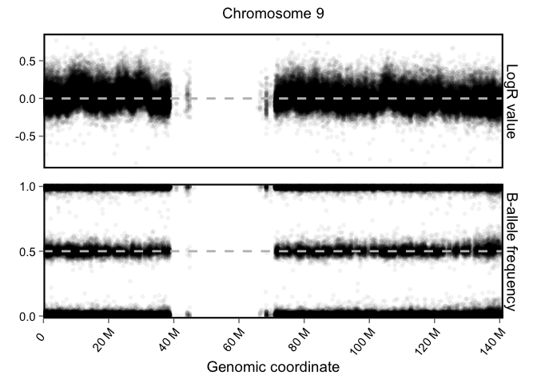

# SNParrays_lrr_baf_plot
Bianca Tesi  
1 Jul 2015  

Packages required:


```r
library(ggplot2)
library(ggthemes)
library(scales)
library(grid)
library(plyr)
library(data.table)
source("format_si.R") #from http://www.moeding.net/archives/32-Metric-prefixes-for-ggplot2-scales.html (Update version of  2012-03-21)
```

PLOT OUTPUT FROM ```taps_plot()``` (can be adjusted for plotting output from ```taps_call()```). For a specific sample and chromosome. Should be possible also to iterate through all samples in the folder.

Variables to be set:

1. directory with ```taps_plot()``` output
2. chromosome name
3. samples to plot
4. if vertical orientation (TRUE/FALSE)


```r
#set variables

taps_path <- "/Users/Bianca/Karolinska/Lab/WES/BGI_WES_2014/follow_up/1471/SNParrays_A393sister/A393sis"
chr <- "chr9" # Select a chromosome to plot. TODO(VZ): Select specific coordinates
plot_samples <- NA # Select which samples to plot; NA will plot all in TAPS folder
plot_flipped <- FALSE
file_ext <- "png"

combined_log2_baf <- TRUE
log2limits <- c(-1,1) # Set limits for log2 scale: points outside this interval will be squished at limits

#read the plot Rdata file
taps_plot_files <- list.files(taps_path, pattern = "TAPS_plot_output.Rdata", recursive = T, full.names = T)
# Need: Log2, alf, (regs, segments)
# Need: regions
lrr.df <- rbindlist(lapply(taps_plot_files, function(x){load(x); data.table(Log2,"Sample"==basename(dirname(x)))}))
baf.df <- rbindlist(lapply(taps_plot_files, function(x){load(x); data.table(alf,"Sample"==basename(dirname(x)))}))
saveRDS(lrr.df, paste(taps_path,"/all_lrr.Rds",sep=""))
saveRDS(baf.df, paste(taps_path,"/all_baf.Rds",sep=""))

load(paste(taps_path,"/allRegions.Rdata",sep=""))
regions.df <- data.table(allRegions$regions)

if(combined_log2_baf==TRUE){
  lrr.df <- lrr.df[,type:="LogR value"]
  baf.df <- baf.df[,type:="B-allele frequency"]
  # Combined LRR and BAF and subset for chromosome of interest
  combined <- rbindlist(list(lrr.df, baf.df))
  setkey(combined, Chromosome, Start)
  # If plotting them together, we need to "squish" outlier points manually to keep us from setting the limits in ggplot
  combined$Value[combined$type=="LogR value" & combined$Value > log2limits[2]] <- log2limits[2] # Squish >1 to ==1
  combined$Value[combined$type=="LogR value" & combined$Value < log2limits[1]] <- log2limits[1] # Squish <-1 to ==-1
  combined$type <- factor(combined$type, levels=c("LogR value", "B-allele frequency"))
  # (Alt: just create two separate plots and paste them together with gridExtra::grid.arrange())
} else { combined <- lrr.df[lrr.df$Chromosome==chr,] }

#--- Subset for selected samples
if(exists("plot_samples") & !is.na(plot_samples)){
  combined <- droplevels(combined[combined$Sample %in% plot_samples,])
  seg.df <- droplevels(seg.df[seg.df$Sample %in% plot_samples,])
}
```


The actual code for plotting


```r
if(!plot_flipped){
  # Plot normal horizontal lineup
  hlines.df <- data.frame(type=factor(c("LogR value", "B-allele frequency")), y=c(0,0.5))
  p <- ggplot(combined[(chr)], aes(x=Start, y=Value)) +
    geom_point(alpha=1/20) +
    #geom_segment(data=regions.df[(chr)], aes(x=Start, xend=End, y=log2, yend=log2), color="#FFC107", alpha=0.5, size=2) + # segmented log2
    coord_cartesian(xlim=c(0,max(combined[(chr)]$Start))) +
    scale_y_continuous(expand=c(0.01,0.01), breaks=pretty_breaks(n=3)) + 
    labs(title=paste("Chromosome ", sub("chr", "", chr), sep=""), y=element_blank(), x="Genomic coordinate") +
    theme_few(base_size=14) +
    theme(panel.border=element_rect(fill=NA, linetype="solid", color="black", size=1.5),
          axis.text.x = element_text(angle=50, vjust=1, hjust=1),
          plot.title = element_text(size=14, vjust=2),
          panel.margin = unit(1, "lines"),
          strip.text=element_text(size=14)) +
    geom_hline(data=hlines.df, aes(yintercept=y), linetype=2, size=1, color="grey") +
    scale_x_continuous(labels=format_si(), breaks=pretty_breaks(n=10), expand=c(0.05,0.05)) +
    facet_grid(type~., scales="free_y")
} else {
  # Plot vertical/long lineup instead
  vlines.df <- data.frame(type=factor(c("LogR value", "B-allele frequency")), x=c(0,0.5))
  p <- ggplot(combined[(chr)], aes(x=Value, y=Start)) +
    geom_point(alpha=1/20) +
   # geom_segment(data=regions.df[(chr)], aes(y=Start, yend=End, x=log2, xend=log2), color="#FFC107", alpha=0.5, size=2) + # segmented log2
    coord_cartesian(ylim=c(0,max(combined[(chr),Start]))) +
    scale_x_continuous(expand=c(0.01,0.01), breaks=pretty_breaks(n=3)) + 
    labs(title=paste("Chromosome ", sub("chr", "", chr), sep=""), x=element_blank(), y="Genomic coordinate") +
    theme_few(base_size=14) +
    theme(panel.border=element_rect(fill=NA, linetype="solid", color="black", size=1.5),
          #axis.text.y = element_text(angle=50, vjust=1, hjust=1),
          plot.title = element_text(size=14, vjust=2),
          panel.margin = unit(1, "lines"),
          strip.text=element_text(size=14)) +
    geom_vline(data=vlines.df, aes(xintercept=x), linetype=2, size=1, color="grey") +
    scale_y_reverse(labels=format_si(), breaks=pretty_breaks(n=10), expand=c(0.05,0.05)) +
    facet_grid(.~type, scale="free")
}  

p
```

 


