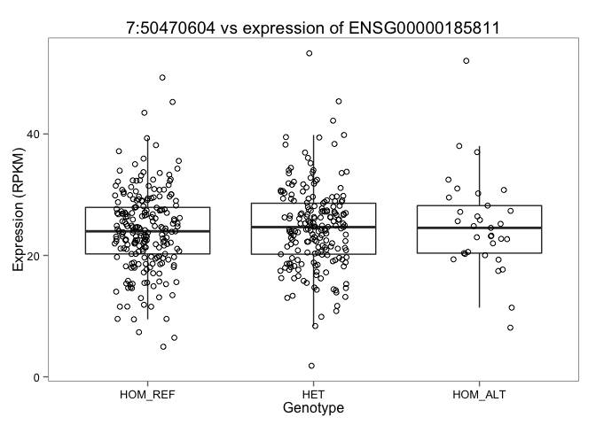
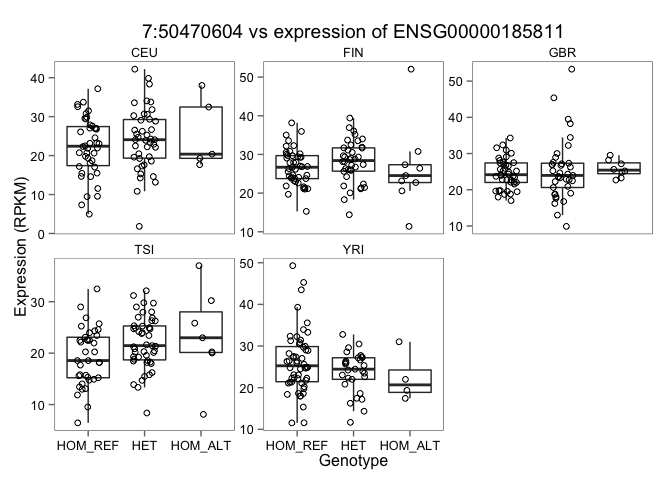
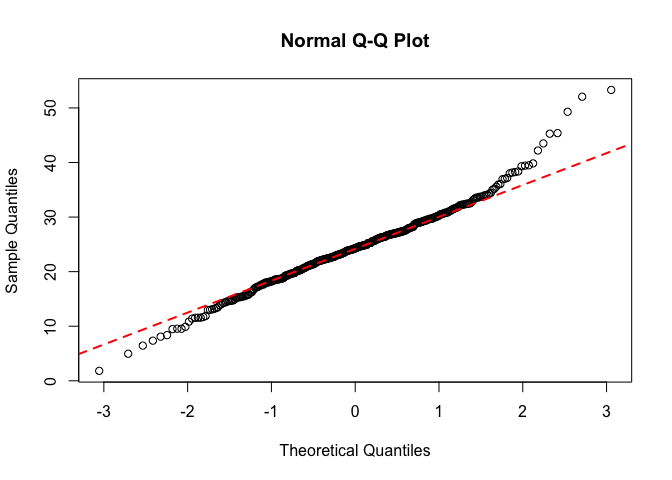

# Plot and calculate genotype vs expression in 1000G individuals
Bianca Tesi and Vasilios Zachariadis  
22 Jul 2015  


```r
suppressPackageStartupMessages(library(data.table))
suppressPackageStartupMessages(library(ggplot2))
suppressPackageStartupMessages(library(ggthemes))
suppressPackageStartupMessages(library(R.utils))
```

Set parameters: 

* GeneID from Ensembl
* Your SNP position (chr and position)


```r
ensid <- "ENSG00000185811"
chr <- 7
position <- 50470604
```

Set public data URLs and read metadata


```r
# File URLs
metadata <- "http://www.ebi.ac.uk/arrayexpress/files/E-GEUV-1/E-GEUV-1.sdrf.txt"
counts.url <- "http://www.ebi.ac.uk/arrayexpress/files/E-GEUV-1/GD462.GeneQuantRPKM.50FN.samplename.resk10.txt.gz"
met <- read.table(metadata, header=T, sep="\t")
```

Use tabix to get genotypes from 1000G (you need`tabix` in your PATH to be able to run this)


```r
gtsfile <- tempfile()
cmd <- paste("tabix -h ftp://ftp-trace.ncbi.nih.gov/1000genomes/ftp//release/20130502/ALL.chr",chr,".phase3_shapeit2_mvncall_integrated_v5a.20130502.genotypes.vcf.gz ",chr,":",position-1,"-",position," | grep -v ^## > ",gtsfile,sep="")
try(system(cmd))
```

Load the table and convert genotypes to text


```r
dat <- read.table(gtsfile, sep="\t", 
									comment.char = "", header=T, check.names = F, colClasses = "character")
if(nrow(dat)>1) dat <- dat[dat$POS==position,]
dat <- dat[,-c(1:9)]
dat <- as.data.frame(t(dat))
colnames(dat) <- "Genotype"
dat$Genotype <- ifelse(dat$Genotype=="0|0", "HOM_REF", 
								 ifelse(dat$Genotype=="0|1" | dat$Genotype=="1|0", "HET", "HOM_ALT"))
```

Download and read Geuvadis gene quantification table (or load from Rds file if run before)


```r
if(!file.exists("GD462.GeneQuantRPKM.Rds")) {
	counts.file <- tempfile(fileext = ".txt.gz")
	download.file(url=counts.url, destfile=counts.file)
	gunzip(counts.file)
	counts <- fread(sub(".gz", "", counts.file),
									header=TRUE, check.names=F, data.table=F)
	saveRDS(counts, "GD462.GeneQuantRPKM.Rds")	
} else {
	counts <- readRDS("GD462.GeneQuantRPKM.Rds")
}
```

Subset for gene of interest 


```r
genecount <- counts[grepl(ensid, counts$Gene_Symbol),]
genecount <- t(genecount[,-c(1:4)])
colnames(genecount) <- ensid
```

Merge genotype and expression tables


```r
dat <- merge(dat, genecount, by = "row.names", all.x = T)
dat <- dat[!is.na(dat[,3]),]
dat$Genotype <- factor(dat$Genotype, levels=c("HOM_REF", "HET", "HOM_ALT"))
colnames(dat)[1] <- "Sample"
```

Add population info


```r
dat$Population <- met[match(dat$Sample, met$Source.Name), "Characteristics.population."]
```

Finally, plot the genotype vs expression


```r
p <- ggplot(dat, aes_string("Genotype", ensid)) +
	geom_boxplot(outlier.size=0) +
	geom_jitter(position = position_jitter(width=.2), pch=21) +
	ggtitle(paste(chr,":",position," vs expression of ",ensid,sep="")) +
	ylab("Expression (RPKM)") +
	theme_few()
p
```

 

You can also plot by population

```r
p + facet_wrap(~Population, scales="free_y")
```

 

Before we can test for genotype - expression correlations, we have to check if the expression data follows a normal distribution. One way of doing this is by QQ-plots.


```r
qqnorm(dat[,3])
qqline(dat[,3], col=2,lwd=2,lty=2)
```

 

Do a non-parametric association analysis (Kruskal-Wallis Rank Sum test), with the null hypothesis being that there is no gene expression difference between the genotype groups. We do it both for the cohort as a whole, and for each individual population. 


```r
kt.pval <- unlist(lapply(levels(dat$Population), function(x){
	kruskal.test(dat$Genotype[dat$Population==x] ~ dat[dat$Population==x,3])$p.value
}))
names(kt.pval) <- levels(dat$Population)
kt.pval <- c("All"=kruskal.test(dat$Genotype ~ dat[,3])$p.value, kt.pval)
print(kt.pval)
```

```
##       All       CEU       FIN       GBR       TSI       YRI 
## 0.4910747 0.4799500 0.4802833 0.4795992 0.4801741 0.4797181
```


```r
anova(lm(dat[,3]~dat$Genotype))
```

```
## Analysis of Variance Table
## 
## Response: dat[, 3]
##               Df  Sum Sq Mean Sq F value Pr(>F)
## dat$Genotype   2    49.1  24.557  0.5254 0.5917
## Residuals    442 20658.1  46.738
```


